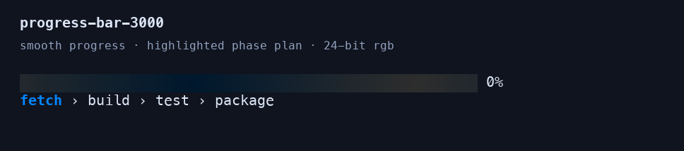
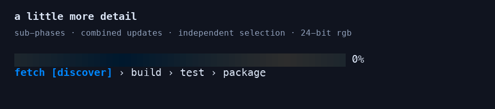
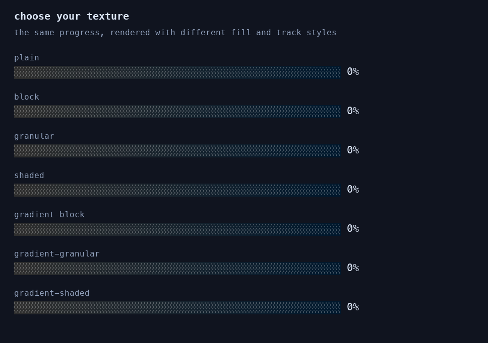
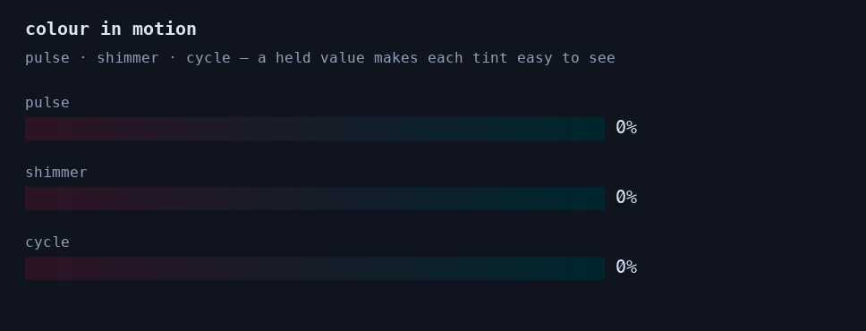
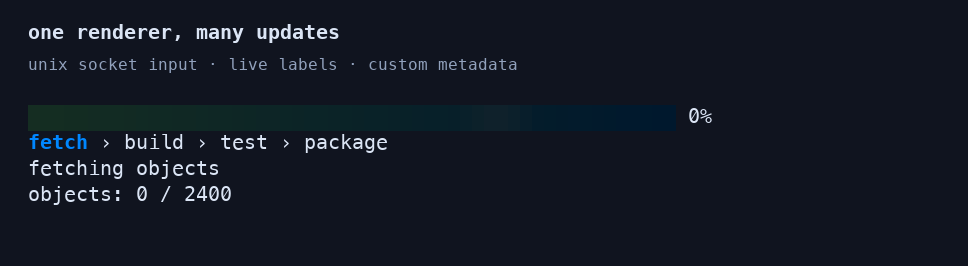

# progress-bar-3000

a terminal progress renderer for shell scripts and agents. send events over stdin or a unix socket; get a smooth gradient bar, a highlighted phase plan, and live detail rows.



- seven fill styles, custom gradients, and pulse, shimmer, or cycle animations.
- plain lines, numeric values, control commands, or json input.
- phase and sub-phase plans, labels, metadata, rates, and eta through format templates.
- socket mode for long-running workflows and a bundled agent skill for tmux.
- completion hooks for automatic cleanup, including closing the bar’s tmux pane.

## quick start

download a pre-built binary from [github releases](https://github.com/atomicstack/progress-bar-3000/releases/latest). go and make are only needed when building from source. run it in a terminal on macos or linux; stdout must be a tty. a truecolour terminal gives the best results.

| platform | v0.4.0 download |
|---|---|
| macos, apple silicon | [darwin arm64](https://github.com/atomicstack/progress-bar-3000/releases/download/v0.4.0/progress-bar-3000_0.4.0_darwin_arm64.tar.gz) |
| macos, intel | [darwin amd64](https://github.com/atomicstack/progress-bar-3000/releases/download/v0.4.0/progress-bar-3000_0.4.0_darwin_amd64.tar.gz) |
| linux, x86-64 | [linux amd64](https://github.com/atomicstack/progress-bar-3000/releases/download/v0.4.0/progress-bar-3000_0.4.0_linux_amd64.tar.gz) |
| linux, arm64 | [linux arm64](https://github.com/atomicstack/progress-bar-3000/releases/download/v0.4.0/progress-bar-3000_0.4.0_linux_arm64.tar.gz) |

extract the matching archive. for example, on an apple silicon mac:

```sh
mkdir -p progress-bar-3000
tar -xzf progress-bar-3000_0.4.0_darwin_arm64.tar.gz -C progress-bar-3000
cd progress-bar-3000
./progress-bar-3000 --help
```

each archive contains the executable, readme, license, demos, example phase files, and agent skill/plugin files. [checksums.txt](https://github.com/atomicstack/progress-bar-3000/releases/download/v0.4.0/checksums.txt) contains sha256 hashes. from the download directory, verify the selected archive on macos:

```sh
archive=progress-bar-3000_0.4.0_darwin_arm64.tar.gz
awk -v archive="$archive" '$2 == archive' checksums.txt | shasum -a 256 -c -
```

on linux, select the matching archive name and use `sha256sum -c -` instead. macos binaries are not notarized.

the default bar fills 90% of the terminal width and follows terminal resizing. use `--width full` to fit the complete row to the viewport, or `--width N` for a fixed bar width. allow room for trailing text in your format; a dedicated `%{phases}` detail row keeps longer labels readable.

one line represents one completed step:

```sh
{
  printf 'fetching\n'; sleep 1
  printf 'building\n'; sleep 1
  printf 'done\n'
} | ./progress-bar-3000 --total 3 --detail=label
```

### build from source

requires go 1.26.2 or newer and `make`:

```sh
git clone https://github.com/atomicstack/progress-bar-3000.git
cd progress-bar-3000
make build
```

## recent changes

- **v0.4.0:** acknowledged `send` batches, one-call `tmux-start`, full-viewport row sizing with `--width full`, descriptive socket path errors, and a streamlined agent skill.
- **v0.3.0:** startup and runtime sub-phase plans, optional combined progress/parent/child updates, a new rgb sub-phase demo, and a default bar width of 90% of terminal columns that follows resizing.
- **v0.2.0:** completion hooks through `--on-complete`, socket control, or json; automatic tmux-pane cleanup; private socket permissions; updated agent guidance.

## phases and smooth gradients

initialize the phase plan before sending progress. this illustrative stream pauses so you can watch it:

```sh
{
  printf '@set-phases fetch,build,test,package\n@set-total 4\n'
  for phase in fetch build test package; do
    printf '@phase-name %s\n' "$phase"
    sleep 1
    printf '@tick\n'
  done
} | ./progress-bar-3000 \
    --width 50 --style gradient-granular \
    --color-mode truecolor --tint-animation cycle \
    --format '%p %{percent}' --detail-format '%{phases}'
```

## sub-phases

show the active child after its parent: `fetch > build [compile] > test > package`.



predefine children in a json phase file (strings and objects can be mixed):

```json
["fetch", {"name":"build","subphases":["compile","link"]}, "test", "package"]
```

```sh
./progress-bar-3000 --phase-file testdata/phase-files/subphases.json \
  --phase build --socket-path /tmp/pb3.sock \
  --format '%p %{percent}' --detail-format '%{phases}'
```

or send these lines over the socket to define and select children dynamically:

```text
@phase-name build
@set-subphases compile,link
@subphase-name link
```

sub-phase selection can stand alone, or accompany progress in one json event:

```json
{"type":"value","value":2,"phase":"build","subphase":"link"}
{"type":"tick","amount":0.25,"phase":"build","subphase":"link"}
```

`phase` and `subphase` are optional on `value` and `tick`. the explicit parent overrides value-to-phase mapping for that event; otherwise the child applies to the parent selected by the new value. use `{"type":"phase","name":"build","subphase":"link"}` to select both labels without changing progress. see [socket updates](#socket-updates-and-custom-rows) for sending acknowledged events with the built-in sender.

configure another parent's children without switching the display:

```json
{"type":"set_subphases","phase":"test","subphases":["unit","integration"]}
{"type":"subphase","phase":"test","name":"integration"}
```

the first child is selected by default. each parent remembers its selection when you leave and return. replacing a child list selects its first entry; `@set-subphases` with no argument or json `"subphases":[]` clears it. these operations leave progress, totals, rate samples, and completion hooks unchanged. `@reset` keeps child plans but selects their first entries; replacing the parent plan discards its old child plans. indexes are zero-based, names are exact, and invalid selections are ignored. plans have one level of children.

## styles

choose a fill texture with `--style` and a track with `--bg-style`. colours are supported across all seven styles.



```sh
printf '20\n45\n80\n100\n' | ./progress-bar-3000 \
    --total 100 --input-mode value \
    --style gradient-shaded --bg-style shade-light
```

## tint animations

set `--tint-animation` to `pulse`, `shimmer`, or `cycle`. customize the endpoints with `--gradient-start` and `--gradient-end`.



```sh
{ printf '@set-total 100\n@value 68\n'; sleep 8; } | ./progress-bar-3000 \
    --color-mode truecolor --tint-animation shimmer \
    --gradient-start '#ff70d2' --gradient-end '#00d8ff'
```

## socket updates and custom rows

keep the renderer alive while separate clients report completed work. labels and metadata make it easy to show what is happening.



start the renderer in a terminal, using a private socket directory:

```sh
sock_dir=$(mktemp -d /tmp/pb3.XXXXXX)
printf 'socket: %s/progress.sock\n' "$sock_dir"
./progress-bar-3000 --socket-path "$sock_dir/progress.sock" \
    --color-mode truecolor --format '%p %{percent}' \
    --detail-format '%{phases}' --detail-format '%{label}' \
    --detail-format 'objects: %{meta:objects} / 2400'
# after ctrl-c exits the renderer:
rmdir "$sock_dir"
```

from another terminal, use the printed socket path with the built-in sender (available since v0.4.0):

```sh
./progress-bar-3000 send --socket-path /tmp/pb3.XXXXXX/progress.sock \
    '@set-phases fetch,build,test,package' '@set-total 100' \
    '@value 40' '@phase-name build' \
    '@label compiling modules' '@meta objects=960'
```

replace the example path with the actual printed path. success is silent and exits zero only after the renderer applies the batch. missing sockets, rejected batches and missing acknowledgements exit nonzero.

send `@value` or `@tick` after work succeeds. send `@set-phases` only when initializing or replacing the plan: it resets progress. socket mode stays alive across client disconnects; press `ctrl-c` in the renderer terminal when finished.

## completion hooks

run a command when the actual value reaches or exceeds a positive total:

```sh
{ printf '@value 1\n'; sleep 1; printf '@value 2\n'; } | ./progress-bar-3000 \
    --total 2 --on-complete 'printf "all done\n" >&2'
```

you can set, replace, or clear the hook at runtime through either input transport:

```text
@on-complete tmux kill-pane -t %42
@on-complete
```

```json
{"type":"on_complete","command":"tmux kill-pane -t %42"}
```

use the pane id returned by your own `tmux split-window -P -F '#{pane_id}'`, never a hardcoded example id or the currently active pane. after creating and initializing the renderer, register its cleanup through the socket:

```sh
# pane is the exact id captured when you created the progress pane.
./progress-bar-3000 send --socket-path "$sock" "@on-complete tmux kill-pane -t $pane"
# after all work and verification succeed:
./progress-bar-3000 send --socket-path "$sock" "@value $total"
```

the pane closes automatically. the [agent skill](skills/progress-bar-3000/SKILL.md#running-inside-tmux) contains the complete setup. the caller remains responsible for other resources and any socket files left behind by abruptly killing a pane. put any cleanup commands before `tmux kill-pane` in a combined hook, since removing the pane can terminate its processes.

- a hook fires once per run. repeated 100% updates, overshooting, going backwards, and replacing a hook after it fires do not run it again.
- `@reset`, `@set-phases`, and json `reset` preserve the current hook and re-arm it. an empty or whitespace-only command disables it.
- setting a hook on an already completed run fires it immediately if no hook has fired yet. reducing the total can also complete a run. with no explicit total, the phase count is used.
- triggering uses the actual value, not the rounded percent or animated fill. the hook may close the pane before the smoothed fill catches up. eof, input errors, and cancellation below 100% do not trigger it.
- commands run through `/bin/sh -c`, inherit the renderer's environment and working directory, receive no stdin, and send output to stderr. labels, metadata, and format tokens are never interpolated into commands. use shell quoting for paths and arguments.
- hooks run serially without blocking redraws. normal shutdown, including `ctrl-c`, waits for queued hooks; hook failures make the eventual process exit nonzero. hooks must finish on their own: there is no timeout or cancellation of a running hook.
- input clients can configure executable shell commands. use trusted producers and a private socket directory. socket files are restricted to mode `0600`.

## things to know

- the producer runs jobs and reports their success; the renderer only executes commands explicitly configured as completion hooks.
- stdin eof means completion, even if a producer failed. use socket mode when failure must leave the displayed progress incomplete.
- feed trusted labels, phases, and metadata: terminal control sequences are not sanitized. keep sockets in a private directory.
- a bar plus one detail row needs exactly two terminal rows. avoid printing the phase in both `--format` and a detail row.
- `--clear-on-exit` removes the display; otherwise the final bar stays visible.

## agent integration

v0.4.0 includes one-call startup and acknowledged updates:

```sh
./progress-bar-3000 tmux-start --phases build,test,review --total 3 --width full --auto-close
# use the actual socket returned above; after the build succeeds:
./progress-bar-3000 send --socket-path /tmp/pb-123456/p.sock '@value 1' '@phase-name test'
```

see [one-call tmux bootstrap](#one-call-tmux-bootstrap) for defaults and returned handles. these helpers are included in the v0.4.0 prebuilt downloads.

[the bundled skill](skills/progress-bar-3000/SKILL.md) describes socket control, phase updates, and a dedicated two-row tmux pane. the repository also contains a claude code plugin manifest. release archives include the ready-to-run binary; source checkouts and source-based plugin installs need `make build` before using the skill.

## development

```sh
make build
make test
make vet
make smoke  # interactive terminal walkthrough
```

### reproduce the demos

the images are lossless animated pngs, recorded from the actual executable in pseudo-terminals with `COLORTERM=truecolor` and `--color-mode truecolor`. no 256-colour palette conversion is applied. a terminal emulator interprets the captured rgb escape sequences before the frames are rasterized.

```sh
python3 -m venv .venv
.venv/bin/pip install -r scripts/demo-requirements.txt
make build
.venv/bin/python scripts/record-demos.py
```

the recorder defaults to menlo on macos. on linux, pass `--font /path/to/monospace.ttf`. use `--only phases`, `subphases`, `styles`, `animations`, or `socket` to regenerate one demo. recording dependencies are optional and are not needed to build or use the cli.

## license

[mit](LICENSE).

## full reference

<details>
<summary>flags, input protocols, templates, rendering, and troubleshooting</summary>

## how it works

1. flags are parsed into a config and validated. bad values fail fast with a
   message naming the flag (for example `--fps must be one of 15, 30, or 60`).
2. initial state is bootstrapped from `--total`, `--current`, `--phase-file`,
   and `--phase`.
3. a bubble tea program starts on stdout and redraws at `--fps`.
4. a reader goroutine pulls lines from the input source (stdin or a unix
   socket), parses each into an event, and sends it to the renderer.
5. every event mutates a single `State` struct: value, total, phase plan, phase
   index, label, and a free-form meta map.
6. `View()` renders `--format` as the first row, then one row per `--detail`
   key, then one row per `--detail-format` template.

exit behaviour depends on the source:

| source | when the program exits |
|---|---|
| stdin pipe | at eof on stdin; the display value snaps to the final value |
| stdin is an interactive tty | never on its own (no events are read, see [Known quirks](#known-quirks)); press `ctrl-c` |
| `--socket-path` | never on its own; it keeps accepting new connections until killed |

## examples

all examples assume `./progress-bar-3000` has been built. swap in `go run .`
if you prefer.

### one line equals one completed step

```bash
printf 'build\ntest\npackage\n' | ./progress-bar-3000 --total 3
```

### numeric value mode

each line is the absolute value, not a delta:

```bash
printf '1\n2\n3\n' | ./progress-bar-3000 --total 3 --input-mode value
```

### control protocol with a phase plan

```bash
{
  printf '@set-phases build,test,package\n'
  printf '@set-total 3\n'
  printf '@phase-name build\n'
  printf '@tick\n'
  printf '@phase-name test\n'
  printf '@tick\n'
  printf '@phase-name package\n'
  printf '@tick\n'
} | ./progress-bar-3000 --style gradient-granular --bg-style shade-light --fps 30
```

### json protocol

```bash
{
  printf '{"type":"reset","total":3,"phases":["build","test","package"]}\n'
  printf '{"type":"tick","amount":1}\n'
  printf '{"type":"phase","name":"test"}\n'
  printf '{"type":"tick","amount":1}\n'
  printf '{"type":"phase","name":"package"}\n'
  printf '{"type":"tick","amount":1}\n'
} | ./progress-bar-3000 --input-mode json --detail
```

### phase file bootstrap

```bash
./progress-bar-3000 --phase-file testdata/phase-files/phases.txt --total 3
```

when `--total` is omitted, the total defaults to the number of phases in the
file.

### custom format and detail rows

```bash
{
  printf '@set-phases fetch,parse,index\n@set-total 300\n'
  printf '@phase-name fetch\n@meta host=api.example.com\n'
  printf '@value 120\n@label 120 objects fetched\n'
  printf '@phase-name parse\n@value 250\n@label parsing manifests\n'
  printf '@phase-name index\n@value 300\n@label done\n'
} | ./progress-bar-3000 \
    --width 40 \
    --format '[%{phase-index}/%{phase-count}] %p %{percent}' \
    --detail=phase,value \
    --detail-format 'label: %{label}' \
    --detail-format '%{meta:host} @ %{rate}, eta %{eta}'
```

### phase strip row

show the whole plan under the bar with the current phase highlighted. the
strip slides when the plan is wider than the terminal.

```bash
{
  printf '@set-phases fetch,resolve,compile,link,test,package,sign,upload\n@set-total 8\n'
  for p in fetch resolve compile link test package sign upload; do
    printf '@phase-name %s\n' "$p"; sleep 1; printf '@tick\n'
  done
} | ./progress-bar-3000 --format '%p %{percent}' --detail-format '%{phases}'
```

### fractional progress and a custom background

```bash
{
  printf '@set-total 1\n'
  for i in $(seq 1 20); do printf '@tick 0.05\n'; sleep 0.1; done
} | ./progress-bar-3000 --bg-style custom --bg-char '·' --gradient-start '#ff7a00' --gradient-end '#ffe600'
```

### erase the bar when done

```bash
printf '%s\n' a b c | ./progress-bar-3000 --total 3 --clear-on-exit
```

### socket input

see [socket updates and custom rows](#socket-updates-and-custom-rows) for a
complete example with a private socket directory and the acknowledged sender.

## flags

run `./progress-bar-3000 --help` for the short form. renderer flags are optional; helper subcommands have their own flags listed below.

### progress bootstrap

| flag | default | description |
|---|---|---|
| `--total N` | `0` | denominator. if `0` and a phase plan exists, both the bar and percent fall back to the phase count (see [Progress semantics](#progress-semantics)). |
| `--current N` | `0` | starting value. |
| `--phase-file PATH` | | load the phase plan from a file before any events arrive. see [Phase files](#phase-files). |
| `--phase NAME` | | select the starting phase by name. only meaningful together with `--phase-file`. |

### input

| flag | default | description |
|---|---|---|
| `--input-mode MODE` | `auto` | one of `auto`, `lines`, `value`, `json`, `control`. only `value` changes how a line is parsed; the other four all rely on prefix auto-detection. see [Input protocols](#input-protocols). |
| `--socket-path /ABS/PATH.sock` | | listen on a unix domain socket instead of reading stdin. must be absolute and must not already exist. |
| `--on-complete COMMAND` | empty | run a shell command once at actual 100%; see [completion hooks](#completion-hooks). |

### layout and text

| flag | default | description |
|---|---|---|
| `--format TEMPLATE` | `%p %{percent} %{phase}` | template for the first row. see [Format templates](#format-templates). |
| `--width N` / `--width full` | `0` (automatic) | automatic uses 90% of terminal columns for the bar, with a minimum of one. `full` reserves surrounding text, divides remaining columns between unprefixed bars on each template row, and clips overflow to the viewport. both follow resizing; a positive number stays fixed. template width prefixes take precedence. |
| `--detail[=KEYS]` | | extra rows below the bar: a comma-separated list of `phase`, `value`, `label`, or `all`. a bare `--detail` means `all`. note the `=`: `--detail phase` does not work because the flag takes an optional value. |
| `--detail-format TEMPLATE` | | one more row rendered from a template. repeatable; rows appear in the order given, after the keyed `--detail` rows. |
| `--clear-on-exit` | `false` | erase the bar and detail rows when the program exits instead of leaving them on screen. |

### appearance

| flag | default | description |
|---|---|---|
| `--style STYLE` | `gradient-granular` | fill glyphs: `plain`, `block`, `granular`, `shaded`, `gradient-block`, `gradient-granular`, `gradient-shaded`. |
| `--bg-style STYLE` | `space` | track behind the unfilled portion: `none`, `space`, `ascii`, `shade-light`, `shade-medium`, `shade-dark`, `custom`. |
| `--bg-char RUNE` | | exactly one rune. required when `--bg-style custom`. |
| `--color-mode MODE` | `auto` | `auto`, `truecolor`, `256`, `16`, `none`. `auto` reads the terminal's advertised profile via termenv. |
| `--gradient-start HEX` | `#ffffff` | colour of the leftmost cell. six hex digits, `#` optional. |
| `--gradient-end HEX` | `#0087ff` | colour of the rightmost cell. |
| `--tint-animation KIND` | | `pulse`, `shimmer`, or `cycle`. omit for a static bar. |
| `--ascii` | `false` | force ascii glyphs: the fill becomes `=` with no partial cells whatever `--style` says, and any non-ascii track glyph (the shade styles, or a non-ascii `--bg-char`) becomes `.`. colour is unaffected; add `--color-mode none` for a plain-text bar. |

### motion

| flag | default | description |
|---|---|---|
| `--fps N` | `60` | redraw rate. must be `15`, `30`, or `60`. animations are wall-clock based so they run at the same speed regardless of fps. |
| `--lerp F` | `0.18` | smoothing factor, `0 < F <= 1`. each frame the displayed value moves this fraction of the way toward the true value. `1` disables smoothing. |

## input protocols

input is line-oriented. blank lines are ignored. any parse error (unknown
command, malformed number, unknown json field) stops the renderer with a
non-zero exit and the error on stderr.

### auto-detection

regardless of `--input-mode`, each trimmed line is dispatched by its first
character:

| first character | treated as |
|---|---|
| `{` | json event |
| `@` | control command |
| anything else | a numeric value if `--input-mode value`, otherwise one tick |

so you can mix `@phase-name` lines into a plain-line stream, or send json
into a renderer started without `--input-mode json`. the `lines`, `json`, and
`control` modes exist for readability and behave the same as `auto`.

### plain line mode

every non-empty line that is not json or a control command advances the value
by one and becomes the label, so `%{label}` and the `label` detail row show
the most recent line.

```bash
some_tool --verbose | ./progress-bar-3000 --total 120
```

this mode exits at eof, which pipes deliver whether or not the producer
succeeded. do not rely on it to signal success.

### value mode

with `--input-mode value`, every non-json, non-control line is parsed as a
float and becomes the absolute value. useful when the producer already knows
its running total (bytes, rows, items).

```bash
some_job --emit-progress | ./progress-bar-3000 --total 1000000 --input-mode value
```

### control protocol

lines starting with `@`. the command name runs to the first whitespace; the
rest of the line is the argument. amounts may be fractional.

| command | argument | effect |
|---|---|---|
| `@tick [amount]` | optional float, default `1` | add `amount` to the value. |
| `@inc <amount>` | required float | same as `@tick`, but the amount is mandatory. |
| `@value <n>` | float | set the absolute value. |
| `@set-total <n>` | integer | change the denominator. does not touch the value. |
| `@phase <index>` | integer, 0-based | select a phase by index. out-of-range indexes are ignored. |
| `@phase-name <name>` | text | select a phase by exact name. unknown names are ignored. |
| `@set-subphases a,b` | comma list, optional | replace the current parent’s child list, selecting the first; no argument clears it. progress is unchanged. |
| `@subphase <index>` | integer, 0-based | select a child of the current parent. invalid indexes are ignored. |
| `@subphase-name <name>` | text | select a child by exact name. unknown names are ignored. |
| `@label <text>` | text | set the free-form label shown by `%{label}` and the `label` detail row. |
| `@meta key=value` | `key=value` | merge one key into the meta map, read back with `%{meta:key}`. repeat to set several keys; later values overwrite earlier ones with the same key. |
| `@set-phases a,b,c` | comma list | replace the phase plan **and reset** progress: value goes to 0, label and meta are cleared, rate samples are dropped. total is kept. an empty list keeps the existing plan but still resets. |
| `@reset` | none | reset progress as above without changing the phase plan or total; re-arm the completion hook. |
| `@on-complete <command>` | shell command, optional | replace the completion hook; no command clears it. |

`@set-phases` does not set the total. send `@set-total` after it (or
before it, the total survives the reset) so the bar has a denominator.

### json protocol

one json object per line. unknown fields are rejected, so keep payloads to
the fields listed. fields default to their zero values unless marked required.
`subphase` requires either `name` or `index`; `set_subphases` requires an array.

| `type` | fields | effect |
|---|---|---|
| `tick` | `amount` (float, `0` or absent means `1`), optional `label`, `phase`, `subphase` (strings) | add `amount` to the value and, if `label` is non-empty, set the label. |
| `value` | `value` (float), optional `phase`, `subphase` (strings) | set the absolute value. |
| `set_total` | `total` (int) | change the denominator. |
| `phase` | `name` (string) or `index` (int, 0-based), optional `subphase` (string) | select a phase. `name` wins when both are present. a `phases` array on this event is rejected; use `reset` to change the plan. |
| `set_subphases` | `subphases` (required string array), `phase` (optional parent name) | replace a child plan; `[]` clears it. omitted parent targets the current phase. |
| `subphase` | `name` (string) or `index` (int, 0-based), `phase` (optional parent name) | select a child without changing progress or the current parent. `name` wins; invalid selections are ignored. |
| `label` | `label` (string) | set the label. |
| `meta` | `meta` (object of string to string) | merge keys into the meta map. |
| `reset` | `total` (int, optional), `phases` (array of strings or phase objects, optional) | reset progress. a positive `total` replaces the total; a present `phases` array replaces the plan; an absent `phases` keeps it. |
| `on_complete` | `command` (string) | replace the completion hook; an empty command clears it. |

note the underscore in `set_total` and `on_complete`. the control equivalent uses a hyphen.

```bash
printf '{"type":"reset","total":4,"phases":["a","b","c","d"]}\n{"type":"meta","meta":{"host":"db1"}}\n{"type":"tick"}\n' \
  | ./progress-bar-3000 --input-mode json --detail-format 'on %{meta:host}'
```

### phase files

`--phase-file` accepts either format:

- **plain text**: one phase name per line, blank lines ignored
  (`testdata/phase-files/phases.txt`).
- **json array of strings or objects** when the extension is `.json`. an object has `name` and optional `subphases` (an array of nonempty strings). unknown object fields and deeper nesting are rejected. flat arrays remain supported (`testdata/phase-files/phases.json`); see `testdata/phase-files/subphases.json` for children. json `reset` accepts the same plan format.

if `--total` is `0`, it is set to the number of parent phases; children never add steps.

## progress semantics

**total and percent.** the effective total is `--total` (or `@set-total`)
when it is positive, otherwise the number of phases in the plan, otherwise
`0`. the bar fill, `%{percent}`, `%{total}`, `%{eta}`, and the `value` detail
row all use the effective total, so a run driven purely by a phase plan
works without an explicit total. with an effective total of `0` the bar
stays empty and the percent reads `0%`.

**value to phase mapping.** when the value changes (tick, inc, or value), the
current phase is recomputed from it: value 1 maps to phase 0, value 2 to
phase 1, and so on, clamped to the last phase. this means with a plan of n
phases and a total of n, ticking after each phase automatically advances the
phase row. an explicit `@phase`/`@phase-name` overrides the mapping until the
next value change. json `value` and `tick` can include optional `phase` and `subphase` strings to update those labels atomically with progress. json `phase` accepts an optional `subphase` too. invalid explicit parents leave the automatic progress mapping in effect and skip the child selection.

**phase index in templates.** `%{phase-index}` is 1-based for display;
`@phase` takes a 0-based index.

**reset.** `@reset`, `@set-phases`, and json `reset` zero the value, clear
the label and meta map, drop rate samples, and restart the `%{timer}` clock.
the display value snaps to 0 immediately rather than animating down.

**rate and eta.** the renderer keeps the last 8 value samples with
timestamps. `%{rate}` is the slope between the oldest and newest retained
sample. `%{eta}` is `(total - value) / rate`, or `0s` when the rate is zero
or the work is complete. rate and eta are based on progress samples; they
retain their last estimate during a stall until another value update arrives.

**smoothing.** value events update the target immediately, and each frame
the displayed fill moves `--lerp` of the remaining gap. the percent text and
detail rows always show the true value; only the bar glyphs lag.

## format templates

`--format` and every `--detail-format` use the same `pv`-style grammar.

### grammar

| syntax | meaning |
|---|---|
| `%{name}` | insert the token `name`. |
| `%20{name}` | insert the token with an explicit width. bar and phase-strip tokens honour the width. |
| `%p`, `%t`, `%e` | single-letter aliases for `progress`, `timer`, `eta`. |
| `%%` | a literal `%`. |
| anything else | copied through verbatim. |

a `%` followed by anything other than `{`, a digit, `%`, or a known alias is
an error, as is an unterminated `%{`. templates are validated at startup, so
mistakes fail before the bar draws.

### tokens

| token | renders as |
|---|---|
| `%p`, `%{progress}`, `%{bar-only}` | the bar. width comes from the prefix, then a positive `--width`, otherwise 90% of terminal columns. `--width full` instead fits bars and surrounding text within each template row. before terminal dimensions arrive, assumes 80 columns (a 72-column automatic bar). with numeric widths, surrounding text is additional. |
| `%{percent}` | `NN%`, rounded to an integer. |
| `%{phase}` | current phase with its active child, e.g. `build [link]`; empty if no plan. |
| `%{subphase}` | active child name without brackets; empty if the current parent has no children. |
| `%{phase-index}` | current phase number, 1-based. |
| `%{phase-count}` | number of phases in the plan. |
| `%{label}` | the last `@label` text. |
| `%{value}` | current value, rounded to an integer. |
| `%{total}` | the effective total (see [Progress semantics](#progress-semantics)). |
| `%{rate}` | units per second, two decimals, with a `/s` suffix. |
| `%e`, `%{eta}` | estimated time remaining as a go duration, for example `1m12s`. |
| `%t`, `%{timer}` | elapsed time since the renderer started or the last reset, truncated to whole seconds, for example `1m5s`. |
| `%{phases}` | the whole phase plan as a strip with the current phase highlighted. see [Phase strip](#phase-strip). |
| `%{meta:KEY}` | the value of `KEY` from `@meta`, or empty. |
| unknown `%{name}` | empty string. not an error. |

### examples

```bash
--format '%p %{percent}'                                  # bar and percent only
--format '%{phase} %30{progress} %{value}/%{total}'       # fixed 30-column bar
--format '[%{phase-index}/%{phase-count}] %p %{percent}'  # step counter prefix
--format '%p %{percent} %%'                               # literal percent sign after the number
```

the default format includes `%{phase}`. if you also enable `--detail=phase`,
the phase is printed twice. pick one home for it.

### phase strip

`%{phases}` renders every phase in the plan on one line, joined by ` › `
(` > ` under `--ascii`). the active child, if any, appears as ` [child]` immediately after the current parent and shares its highlight and scrolling budget. other parents show only their names. only the current phase is highlighted: it is drawn
bold in the `--gradient-end` colour with a slow saturation pulse. completed
and pending phases are both dimmed. with `--color-mode none` the current
phase is wrapped in `[brackets]` instead, followed by a separate child bracket when present: `[build] [link]`. the token renders nothing when no
phase plan is loaded, so it only earns its place when the phase names are
known up front via `--phase-file`, `@set-phases`, or a json `reset`.

```text
build › test › package › sign › upload
 dim    dim   highlight   dim    dim
```

the strip has a column budget: the width prefix if you give one
(`%60{phases}`), otherwise the terminal width. when the plan is wider than
the budget, a window slides along the strip so the current phase and a
little context on either side stay visible, with `…` marking a clipped
edge. the window's position eases toward its target using `--lerp`, and on a
phase change the highlight crossfades from the old phase to the new one over
about 300 ms. the output is padded to the budget so rows below it do not
jitter.

put it on its own row so the width budget is not shared with other tokens:

```bash
./progress-bar-3000 --phase-file phases.txt --format '%p %{percent}' --detail-format '%{phases}'
```

details worth knowing:

- separators are drawn dim, like the non-current phases.
- wide characters in phase names are measured with their real cell width, so
  cjk or emoji names line up; a wide glyph split by the ellipsis is blanked
  rather than half-drawn.
- if you use `%{phases}` more than once, all copies share one scroll
  position, driven by the width prefix of the first occurrence.
- the saturation pulse runs whether or not `--tint-animation` is set. with a
  fully saturated `--gradient-end` such as the default blue, only the
  desaturating half of the pulse is visible.

## detail rows

rows appear below the bar in this order:

1. keyed rows from `--detail`, always in the fixed order `phase`, `value`,
   `label` regardless of how you list them. each is a fixed
   `key: value` line (`phase: test`, `value: 3/5`, `label: linking`).
2. one row per `--detail-format`, in the order given on the command line.

```bash
./progress-bar-3000 --detail=value,phase --detail-format 'eta %{eta}' --detail-format '%{label}'
# row 1: bar
# row 2: phase: ...
# row 3: value: N/M
# row 4: eta ...
# row 5: <label>
```

every row is redrawn on every frame, so detail rows reflect the state as it
changes. a frame occupies exactly the rows it prints, so a bar plus one
detail row fits a 2-row tmux pane. if the pane is shorter than the frame,
bubble tea drops rows from the top, so the bar disappears first; size the
pane to the number of rows you print.

## appearance

### styles

| `--style` | filled cell | partial cell | gradient |
|---|---|---|---|
| `plain` | `=` | none | no |
| `block` | `█` | none | no |
| `granular` | `█` | `▏▎▍▌▋▊▉` (eighths) | no |
| `shaded` | `█` | `░▒▓` | no |
| `gradient-block` | `█` | none | yes |
| `gradient-granular` | `█` | eighths | yes |
| `gradient-shaded` | `█` | `░▒▓` | yes |

filled cells are coloured along the gradient from `--gradient-start` to
`--gradient-end` in all styles when colour is enabled. the `gradient-*`
names are kept for clarity and for the smoke script; the colouring code path
is shared.

### backgrounds

| `--bg-style` | track glyph | coloured track |
|---|---|---|
| `none` | space | no |
| `space` | space | yes (dimmed gradient behind the space) |
| `ascii` | `.` | yes |
| `shade-light` | `░` | yes |
| `shade-medium` | `▒` | yes |
| `shade-dark` | `▓` | yes |
| `custom` | `--bg-char` | yes |

the track colour is the gradient colour for that column scaled to 18%
brightness, with the glyph drawn in a slightly lighter tint of the same
colour.

### colour modes

`auto` maps the terminal's termenv profile to `truecolor`, `256`, `16`, or
`none`. truecolor is used when detection is inconclusive. force a mode when
running under a multiplexer or a ci recorder that misreports its
capabilities. `none` emits no escape codes at all.

### tint animations

all animations are keyed to wall-clock time, so they look the same at any
`--fps`.

| `--tint-animation` | effect |
|---|---|
| `pulse` | the whole fill brightens and dims on a 2.5 s cycle, returning exactly to the base colour at the trough. |
| `shimmer` | a soft bright band sweeps left to right across both fill and track every 2.8 s, entering and leaving off the edges. |
| `cycle` | the gradient slides along the bar on a 4 s loop, folded as start→end→start so there is no visible seam. |

## socket mode

`--socket-path` replaces stdin with a unix domain socket listener. the path must be absolute and must not exist at startup. sockets use mode `0600`; put them in a unique private `0700` directory, for example `mktemp -d /tmp/pb3.XXXXXX`. the renderer removes the socket on clean shutdown; the caller owns the directory.

keep paths short: macos permits 103 path bytes and linux 107, reserving a terminator in their 104/108-byte `sun_path` fields. deep scratchpad paths and macos `$TMPDIR` can exceed this. path validation reports the actual byte count and platform limit before binding, with a hint to use a shorter directory. `tmux-start` creates a short private directory automatically.

socket mode stays alive across client disconnects and completion unless a hook closes it. raw newline-delimited clients remain supported; the renderer processes one connection at a time. use the built-in sender for acknowledged delivery:

```sh
./progress-bar-3000 send --socket-path "$sock" '@value 1' '@phase-name test'
printf '@value 2\n@phase-name review\n' | ./progress-bar-3000 send --socket-path "$sock"
./progress-bar-3000 send --socket-path "$sock" --json '{"type":"value","value":2,"phase":"review","subphase":"docs"}'
```

use a sender and renderer that both include these helpers (v0.4.0 or newer). `send` reads one event per argument, or newline-delimited stdin if none are supplied. it validates the whole batch before applying events. the renderer acknowledges after applying the batch, before starting completion hooks that might close the pane. unknown phase/subphase names retain their existing ignored-selection behaviour.

| sender flag | default | description |
|---|---|---|
| `--socket-path PATH` | required | renderer socket |
| `--json` | `false` | require each event to be a json object |
| `--timeout DURATION` | `3s` | maximum connect, send and acknowledgement duration |

success is silent. missing/refused sockets, malformed or rejected requests, and missing/invalid acknowledgements exit nonzero. an acknowledgement confirms state application, not pixel rendering or hook success. after a lost acknowledgement, a batch may already have applied: do not blindly retry increments or other non-idempotent events. inspect state/display before recovering.

### acknowledgement wire format

custom clients can send one newline-terminated envelope per connection:

```json
{"protocol":"progress-bar-3000/send-v1","events":["@value 1","@phase-name test"]}
```

successful response:

```json
{"protocol":"progress-bar-3000/send-v1","ok":true,"count":2}
```

a rejection returns `ok:false`, `count:0`, and an `error` string. batches are limited to 256 events and 1 mib of encoded request data. the built-in sender limits replies to 64 kib. raw clients receive no application acknowledgement; the skill retains a legacy fallback in its appendix.

### one-call tmux bootstrap

from the agent's tmux pane:

```sh
./progress-bar-3000 tmux-start --phases build,test,review --total 3 --width full --auto-close
```

the command prints json handles: `pane`, `socket`, `pid`, and `window`. retain the actual values for subsequent `send` calls. `--output shell` emits safely quoted `PB_PANE`, `PB_SOCK`, `PB_PID`, and `PB_WINDOW` assignments instead; shell variables do not persist across independent agent tool calls.

| bootstrap flag | default | description |
|---|---|---|
| `--phases a,b,c` | required | nonempty comma-separated phase names |
| `--total N` | phase count | positive work total |
| `--width WIDTH` | `full` | full viewport row, automatic `0`, or positive columns |
| `--auto-close` | `true` | remove the private socket directory and exact pane at completion; use `--auto-close=false` to manage cleanup yourself |
| `--output FORMAT` | `json` | `json` or `shell` |
| `--timeout DURATION` | `10s` | maximum startup time |

bootstrap requires `TMUX` and the agent's own `TMUX_PANE`. it uses that pane directly as `-t` in a single `tmux split-window -d -v -l 2` invocation which also starts the renderer command, then verifies the new pane belongs to the same window. it sets `gradient-granular`, cycling tint, `%p %{percent}`, and one `%{phases}` detail row. it hides only its own border label with `tmux set-option -p -t <pane> pane-border-format ""`.

it sends `@set-phases` first, initializes total/value/phase, registers cleanup, and verifies the initial two-row frame before returning success. failed startup rolls back owned resources. completion is acknowledged before the hook removes the socket directory and pane. if later task work fails below 100%, the caller must remove the saved owned pane and directory explicitly; do not fake completion to clean up. the [agent skill](skills/progress-bar-3000/SKILL.md) provides the complete workflow and honest milestone rules.

## claude code plugin

the repo root is a claude code plugin. once installed, the skill resolves the
binary at `$CLAUDE_PLUGIN_ROOT/progress-bar-3000`; in a plain checkout it
uses `./progress-bar-3000`. either way the binary must be built first:

```bash
make build                                # in a checkout
make -C "$CLAUDE_PLUGIN_ROOT" build       # in an installed plugin
```

the skill triggers on requests like "show progress" or "add a progress bar"
during multi-step work and drives the renderer using socket mode from a
two-row pane at the bottom of the agent's tmux window. changes to flag
names, defaults, or output layout need a matching edit to the skill.

## development

the `Makefile` pins `GOCACHE` and `GOMODCACHE` to in-repo directories, so
prefer it over raw `go` commands for cache hits.

| target | what it does |
|---|---|
| `make build` | `go build -o ./progress-bar-3000 .` |
| `make test` | `go test ./...` (takes about a second) |
| `make vet` | `go vet ./...` |
| `make smoke` | build, then run `scripts/smoke.sh`, an interactive visual walkthrough of every mode (needs a tty) |
| `make clean` | remove the built binary |

package layout:

| package | responsibility |
|---|---|
| `internal/cli` | cobra flag wiring into `config.Config` |
| `internal/config` | the `Config` struct, enums, and `Validate()` |
| `internal/input` | stdin and socket sources, line parsing for all three protocols, phase file loading |
| `internal/progress` | pure `State` with `Apply(event)`, percent, phase mapping, rate, and eta |
| `internal/format` | the template parser shared by `--format` and `--detail-format` |
| `internal/render` | colour profile handling and bar cell rasterisation |
| `internal/app` | the bubble tea model, `Run`, and the tty guard |

render tests call `View()` directly and strip ansi escapes before asserting
on text; follow that pattern in `internal/app/model_test.go` for new
rendering assertions.

## known quirks

- **stdout must be a tty.** redirecting stdout to a file or pipe exits with
  `stdout must be a TTY for progress rendering`.
- **interactive stdin is not read for events.** when stdin is a terminal,
  bubble tea owns it for keystrokes and the event reader is disabled. typing
  `@tick` at the prompt does nothing. use `--socket-path` to feed events
  interactively.
- **`--detail` needs `=`.** because the flag has an optional value, write
  `--detail=phase`, not `--detail phase`. the latter reads as `--detail=all`
  followed by a positional argument, which is rejected with
  `unknown command "phase"`.
- **`@set-phases` resets progress.** it zeroes the value and clears label
  and meta. send it before any ticks, or resend the value afterwards.
- **duplicate phase output.** the default `--format` prints `%{phase}`, and so
  does `--detail=phase`. drop one of them.
- **pane too short hides the bar first.** bubble tea trims frames from the
  top when the terminal has fewer rows than the frame, so an undersized tmux
  pane shows the bottom detail rows and drops the bar. give the pane one row
  per printed row.
- **stdin eof means done.** in pipe mode the renderer exits and snaps to the
  final value when the producer closes the pipe, even if the producer failed.
  use socket mode for fallible workflows where the final state matters.

</details>
